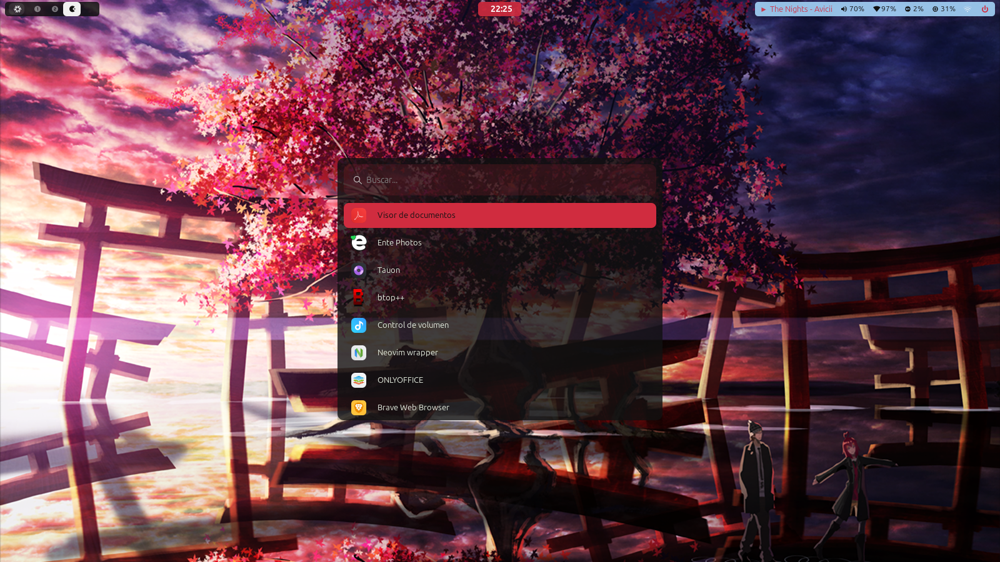
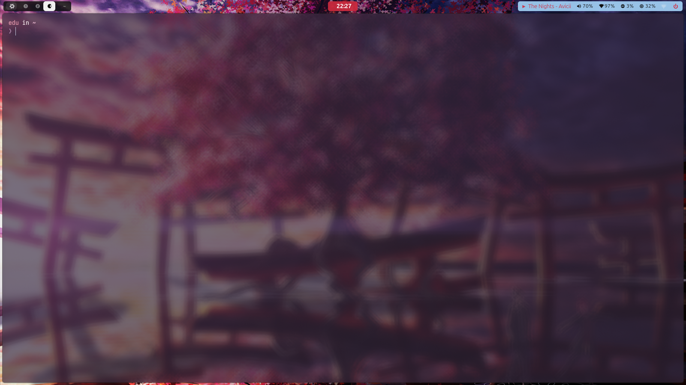

# ❄️ config-nixos

> Declarative NixOS configuration for my personal system — managed with [Nix Flakes](https://nixos.wiki/wiki/Flakes) and [Home Manager](https://github.com/nix-community/home-manager).


<p align="center">
  
  
</p>

---

## ✨ Features

| Feature | Description |
|---|---|
| **Flakes** | Fully reproducible builds with pinned `flake.lock` |
| **Home Manager** | User-space dotfiles and program management |
| **Hyprland** | Wayland compositor with idle & session config |
| **Waybar** | Custom status bar with CSS theming |
| **Wofi** | App launcher with custom styles |
| **Swaync** | Notification center |
| **Kitty** | GPU-accelerated terminal |
| **Fastfetch** | System info with custom logos |

---

## 📦 Main Inputs

| Input | Description |
|---|---|
| `nixpkgs` | Stable NixOS package channel |
| `home-manager` | User environment management |

---

## 🛠 Prerequisites

- NixOS installed
- Flakes enabled

```nix
nix.settings.experimental-features = [ "nix-command" "flakes" ];
```

---

## 🚀 Installation

**1. Clone the repository**

```bash
git clone https://github.com/Puasson/config-nixos.git ~/.config/nixos
cd ~/.config/nixos
```

**2. Generate hardware configuration**

```bash
nixos-generate-config --show-hardware-config
# Copy output to hosts/<hostname>/hardware-configuration.nix
```

**3. Apply system configuration**

```bash
sudo nixos-rebuild switch --flake .#<hostname>
```

**4. Apply Home Manager configuration** *(optional)*

```bash
home-manager switch --flake .#<username>
```

---

## ⚙️ Usage

### Rebuild the system

```bash
# Apply changes
sudo nixos-rebuild switch --flake .#<hostname>

# Test without permanently activating
sudo nixos-rebuild test --flake .#<hostname>

# Build without activating
sudo nixos-rebuild build --flake .#<hostname>
```

### Update dependencies

```bash
nix flake update
sudo nixos-rebuild switch --flake .#<hostname>
```

### Roll back to a previous generation

```bash
sudo nixos-rebuild switch --rollback
# or select a previous generation from the bootloader at startup
```

---

## 📄 License

[MIT](LICENSE)